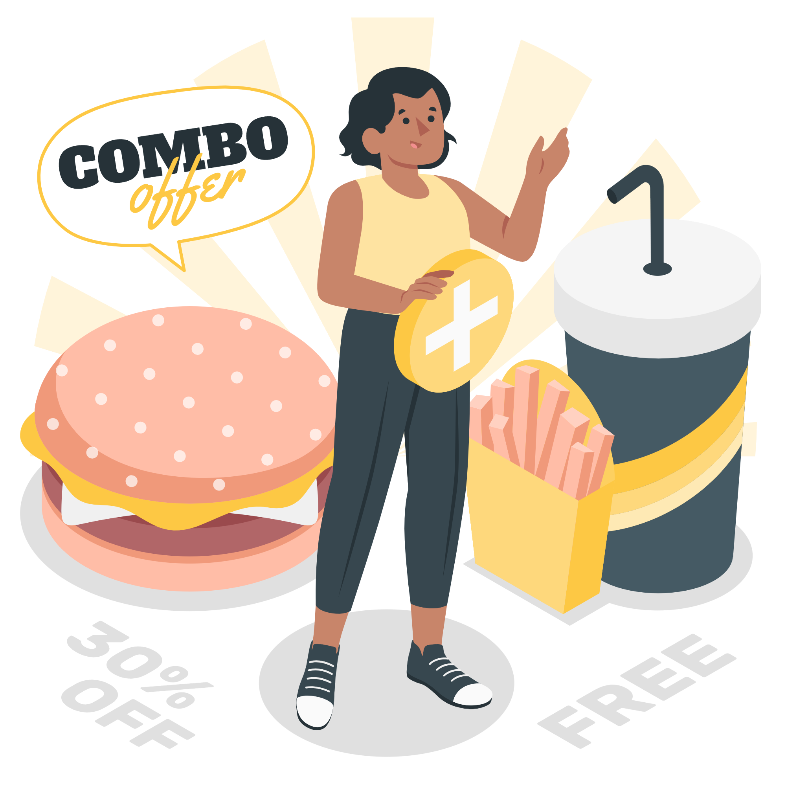
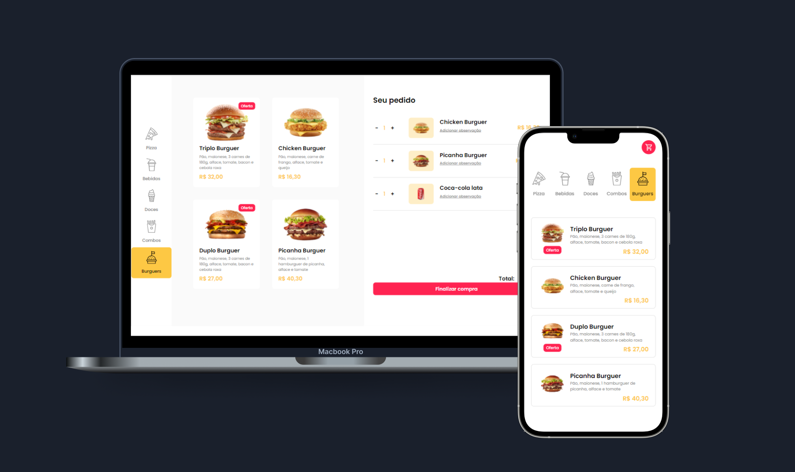
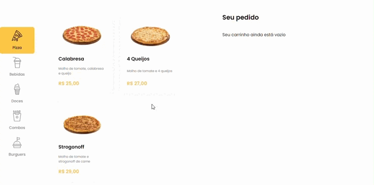
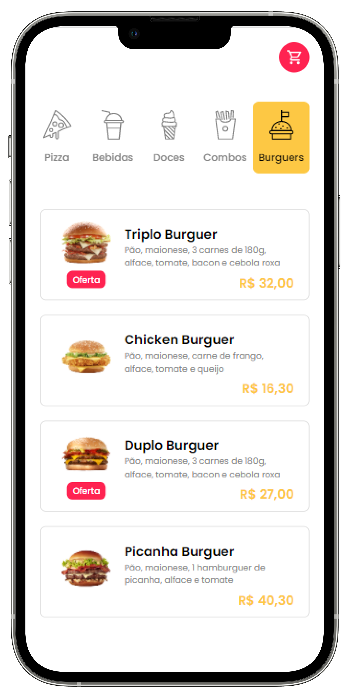
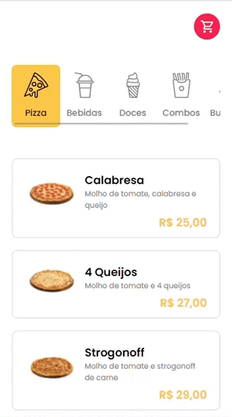

	<h2 align="center">Restaurante
    
  
  </h2>

<h3  align="center">
		✅ Status: concluído ✅
</h3>

  <a href="https://storyset.com/illustration/combo-offer/amico" target="_blank">illustrations by Storyset </a>
 

                                                                              
 

## 📚 Sobre
Projeto desenvolvido durante o curso Frontstart, visando facilitar e agilizar a gestão de pedidos recebidos em um restaurante pequeno que oferece serviço de delivery. Nele, o cliente escolhe os comes e bebes, preenche o formulário com seus dados e seleciona a forma de pagamento. Ao concluir, o pedido é enviado para o WhatsApp do restaurante por meio da API do próprio WhatsApp. 
 
## 🖥️ Demonstração

   

 

  

  
  

## 🚀 Tecnologias

- HTML5
- CSS3
- JavaScript
- Vue.js
- Less
- API WhatsApp

## 👩‍💻 Executar Projeto

Clone ou baixe como arquivo ZIP. Abra seu terminal, vá para a pasta do projeto e execute `npm install` para instalar todas as dependências. Para executar o projeto, execute `npm run serve` e ele será aberto no localhost.
